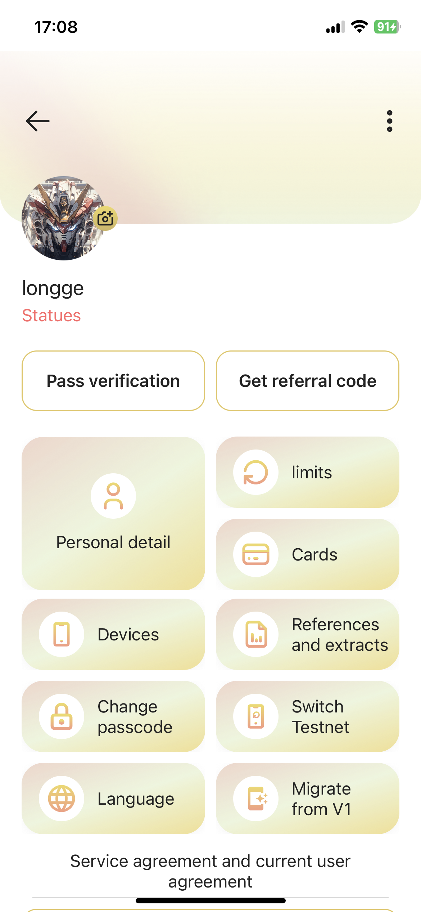
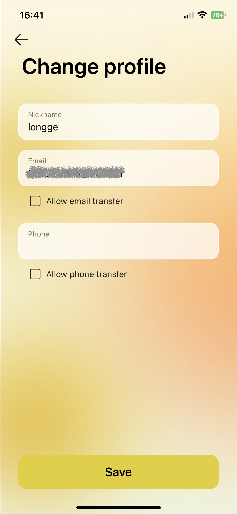

# Account Setting
On the current page, you can view your detailed information, including avatar, invitation code, phone number, email address, agreement, bank card, device, change password, change language, change main chain, and merge accounts.

#### Change avatar
You can **click on the avatar** and freely choose to get it from the photo album or take a photo now to update your avatar.

#### Share invitation code
Click **Get referral code**, and copy the corresponding invitation link or just the invitation code in the pop-up prompt box.

#### View user details
You can change your nickname on the details page, and check whether other people can directly transfer money to your bound wallet through email or mobile phone number.

After modifying any information, click Save.

#### Manage cards
Tap **Cards** here to manage all your credit cards, including: view credit card list, add credit card, delete credit card.

#### Change password
Click **Change password** here to change your login password.

#### Change the main chain
Click **Switch Testnet** to pop up the tab, select the main chain or the test chain, please note: the application needs to be restarted to take effect after the change.

#### Change language
Click **Language** to pop up the tab, select the language you want the APP to display, and it will take effect immediately after switching.

#### Merge V1 account
Please refer to [Migrate JCC From V1](wallet_app/migrate_JCC_from_V1.md) .

#### Sign out
Swipe to the bottom and tap the **Log out** button to log out of the currently logged in account. After success, it will jump to the login page.

#### Delete account
Click the menu button in the upper right corner, pop up the tab, select delete account, and your account will be deleted after 2 confirmations. Please note: this behavior is risky, please operate with caution!



* **Your data will be deleted and cannot be restored!**
    * **Your account**
    * **Your wallet mnemonic, key, address**



