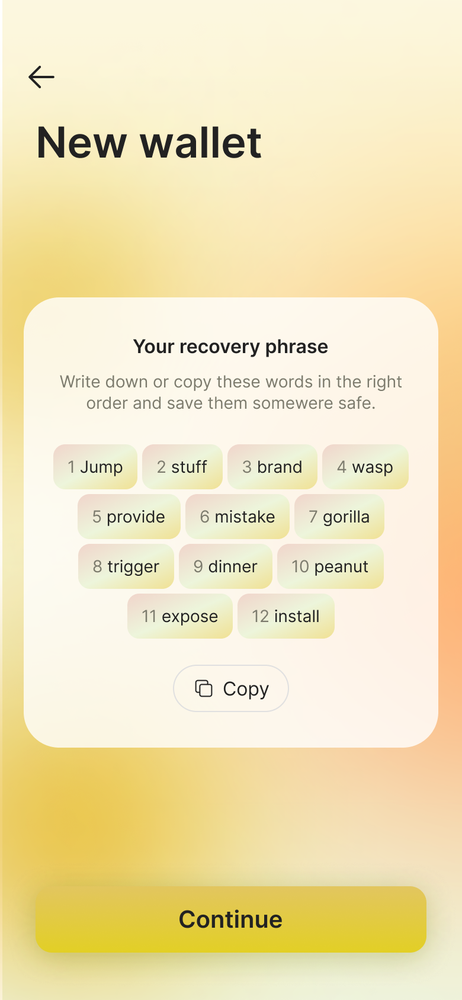

# Create a new wallet

1.Launch the Junca app, sign up and select **Continue**.

2.You can see **Your recovery phrase**, save it. 

🔥PROTECT YOUR SEED PHRASE
Anyone who gains access to your seed phrase can access the contents of the corresponding wallet. Be cognizant of the fact that there is no recourse for theft of a seed phrase. To protect your seed phrase, consider the following tips.

* Never save or store your seed phrase as a digital file on any device.
* Always write down your seed phrase with a pen and paper.
* Store the paper with your seed phrase on it somewhere safe.
* Never give your seed phrase to anyone, not even support staff.


3.Enter **the corresponding word** in the mnemonic according to the number in front to ensure that you have saved your mnemonic.

4.Finally, enter your **wallet name** and wait for the procedure to finish creating the wallet.

Congratulations, you have just created a wallet!

