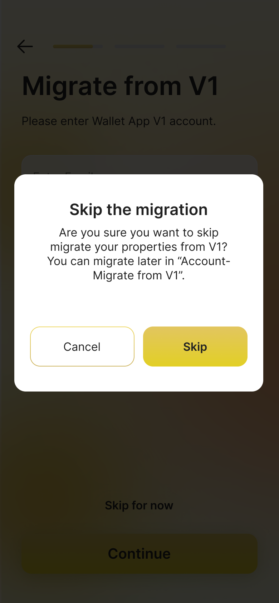

# Migrate JCC from Wallet V1

##### 1.Enter info of V1

First enter your email address and password in the V1 version, and then choose to transfer the V1 assets to the wallet. Please wait patiently after submission!

Enter the verification code received by email, and the transfer will start if the verification is successful. Generally, it will be processed within 24 hours, and the result will be sent to you by email.

**Please be patient after submitting!**

##### 2.Skip for now

Of course, you can also skip the current transfer step and reactivate this step in the user center later.

