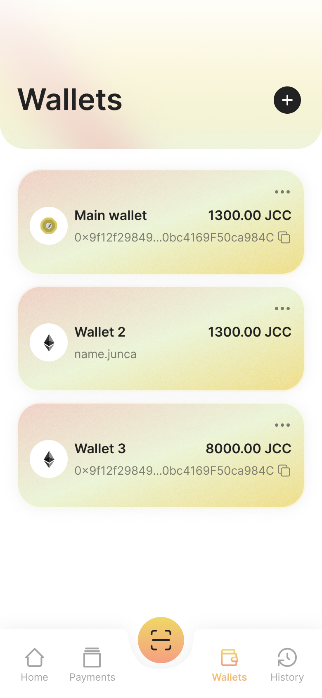
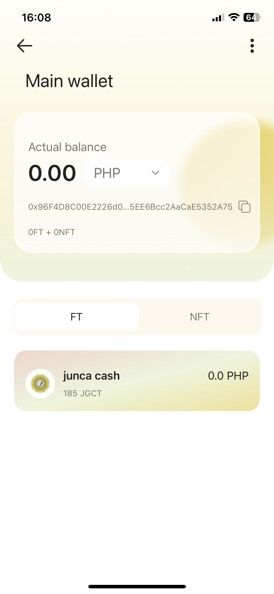
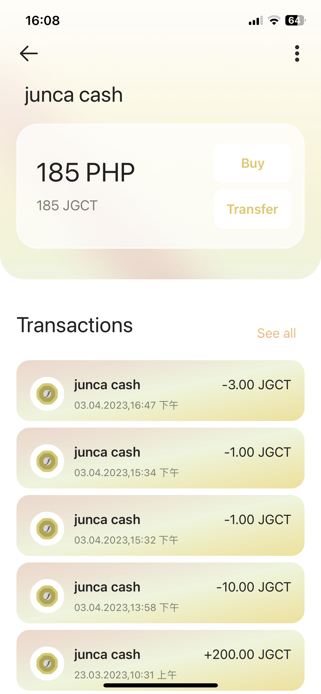

# Manage all wallets
Here you can manage all your wallets, you can view, create, restore, delete your wallets.

##### Create/restore wallet
Click the ➕ button in the upper right corner, you can jump to the create/restore wallet page, create a wallet or restore a wallet.

##### View wallet details
Click on a single wallet in the list to enter the wallet details to view the currency and balance held by the wallet.

##### View currency details
Click on the currency, enter the details to view currency transaction records, transfer the currency to other wallets.

##### delete wallet
On the wallet details page, click the button in the upper right corner to pop up the delete operation button.



If you need to use this wallet in the future, please confirm that you have properly saved its mnemonic before deleting.



