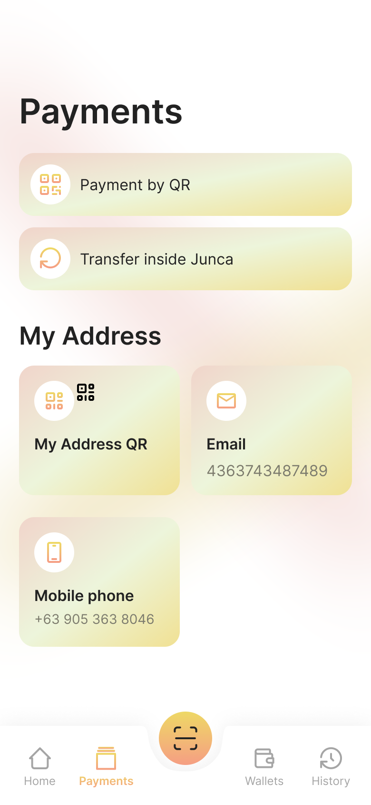

# How to Payments
Junca APP supports **two payment methods**, one is to **scan the code** to transfer money, and the other is to transfer money **by nickname/email/phone number**.

### Payment by QR
##### 1.Scan QR
Click the button to jump to the code scanning interface. Another user can click the button to generate a QR code for you to scan. After scanning, the wallet address of the other party will be automatically filled in.

##### 2.Generate your own wallet QR code
Click the button to generate a QR code for you to scan, and you can send a screenshot of the QR code to the transfer party, and he can transfer money to you through your QR code.

After scanning the code to get the user's wallet address, it will jump to the following page for entering the amount.

### Transfer inside Junca
Transfer via nickname/email/wallet address
We will search for the corresponding nickname/email on our centralized server, obtain the wallet address bound to the other party, and transfer money.

After querying the user's wallet address, it will jump to the following page for entering the amount.

### Enter mount
* Select the wallet you use to pay
* Select currency
* Enter the transfer amount
* Write remarks (optional)

Now, wait for a few minutes and ask the recipient if the account has arrived.

