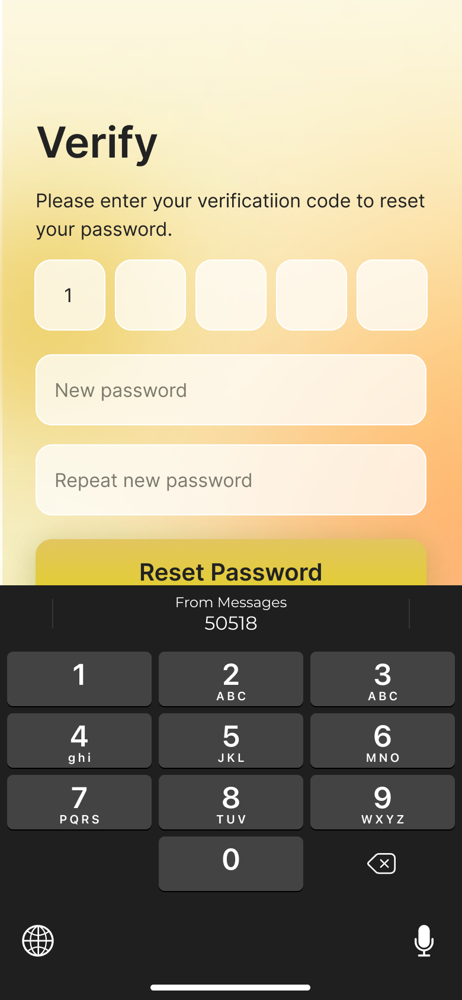

# Login and Register in Junca

Frist, launch the Junca app, select **Get started**.

## Login
##### 1.Choose a login method，There are three ways to log in
* Mobile phone/email password login
* Apple login
* Google login

##### 2.Mobile phone/email password login
Enter the registered nickname or mobile phone or email address and password, and select **Sign in**

##### 3.Sign in with Apple
Using the new login method will obtain your **Apple ID email address** to register and log in to Junca

##### 4.Sign in with Google
Using the new login method will obtain your **Google mailbox** to register and log in to Junca

##### 5.Sign in again to use Face ID
After you log in once, you can use **Face ID** to log in again next time you open the app

## Register
##### 1.Enter basic information: phone/email, nickname, password, invitation code (optional)

##### 2.Fill in the verification code received by phone/email

##### 3.Select Restore Wallet/New Wallet/Create Wallet Later to enter the subsequent process

## Forget Password
##### 1.Enter your phone or email to reset your password.

##### 2.Please enter your verificatiion code and new password to reset your password.

Choose to **Reset Password**, and you can log in with the new password after success!

